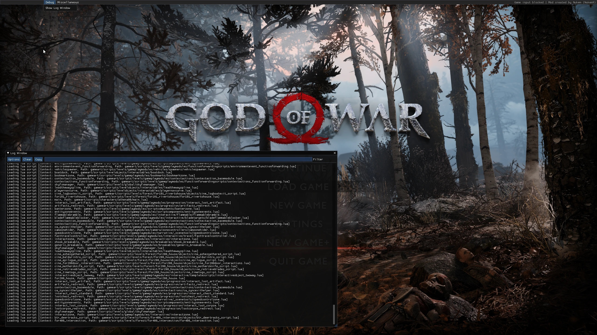

# God of War Gameplay Tweaks & Lua Injector

Source code for the God of War (2018) mod.

## Building

- CMake and vcpkg are expected to be set up beforehand. Visual Studio 2022 is recommended.

```
git clone --recurse-submodules https://github.com/Nukem9/gow-gameplay-tweaks.git
cmake --preset final-universal
cmake --build --preset final-universal-release
```

## Installation

- For developers, edit `CMakeUserEnvVars.json` and set `GAME_ROOT_DIRECTORY` to God of War's root directory. The build script will automatically copy library files to the game folder.

- For manual Steam installs, copy `version.dll` and the `mods` folder to the game's root folder. An example path is: `C:\Program Files (x86)\Steam\steamapps\common\GodOfWar`

## Configuration

- All options are stored in the [loader_config.toml](resources/mods/loader_config.toml) file.

## Custom Lua Files

- Lua file overrides are loaded from the `mods\lua` subdirectory.

## Screenshot



## License

- No license provided. TBD.
- Dependencies are under their respective licenses.
